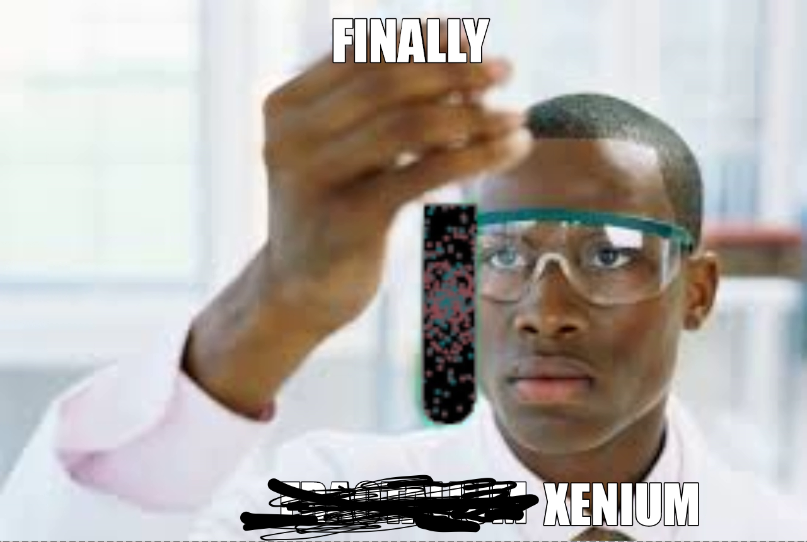
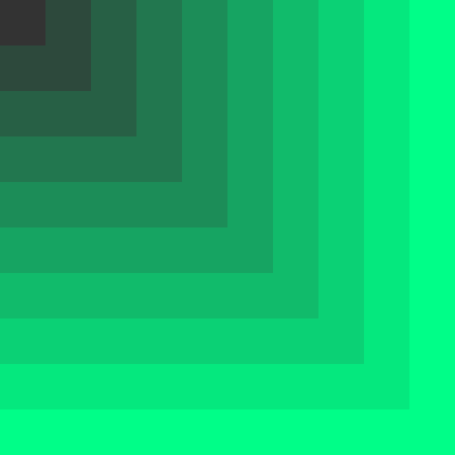
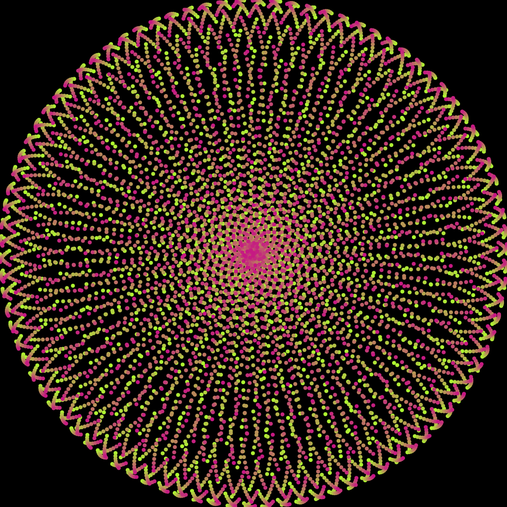

# Xenium
 
Библиотека для генерации множества точек фрактала по его описанию.

<p align="center">
  
</p> 

## Installation

```bash
$ npm install xenuim
```

## Основные концепции

Класс **Fractal** является описанием фрактала. Он содержит необходимую информацию, такую как ширина, высота, цвета, кол-во итераций и т.д. 

**Fractal** должен иметь метод **generate**, который отвечает за построение фрактала по информации, содержащейся в объекте.

Этот метод **не** рисует фрактал. Он лишь предоставляет информацию **как** его отрисовать. За отрисовку отвечает класс **Proxy**.

**generate** принимает **Proxy** и **Caption**.

**Proxy** получает инструкции о том, как отрисовать фрактал, и рисует его. 

**Caption** занимается логгированием информации о фрактале. Другими словами, является текстовым описанием фрактала.

## Quick example 

### promise based
```ts
const fractal = new FractalTest(500, 500, 10, 
  	new Color("#333333"), 
	new Color("#00FF88")
)
const proxy = new CanvasProxy(500, 500)
const caption = new Caption()

fractal.generate(proxy, caption).then(() => {
	console.log(caption.toString())
	console.log(proxy.context.canvas.toDataURL())
})
```

### async/await based
```ts
;(async () => {
	const fractal = new FractalTest(500, 500, 10, 
		new Color("#333333"), 
		new Color("#00FF88")
	)
	const proxy = new CanvasProxy(500, 500)
	const caption = new Caption()

	await fractal.generate(proxy, caption)

	console.log(caption.toString())
	console.log(proxy.context.canvas.toDataURL())
})()
```

### Result

<p align="center">
  
</p> 


## Library fractals.
- FractalTest
  - Linear gradient from the corner of the image.
- FractalComplexFunctionChaos
  - Check /img 
- FractalComplexFunctionHole
  - Check /img
- FractalComplexFunctionKnot
  - Check /img
- FractalComplexFunctionSphere
  - Check /img
- FractalComplexFunctionWhirl
  - Check /img

## Library proxies.

- StubProxy
  - Does nothing ¯\\\_(ツ)\_/¯
- StorageProxy
  - Stores all render instructions in array.
- CanvasProxy
  - Renders fractal on the canvas. (Works only on server side)

## Main idea

Нужно сгенерировать свой фрактал/изображение? Пишем свой класс-наследник **Fractal** с методом **generate**.

Нужно рендерить изображение не на Canvas(в 3d, наример)? ~~Пользуемся StorageProxy и пишем отрисовку руками~~. Пишем свой класс Proxy.

(Понял, что идея не работает. Нужно переделать)

## More examples

```ts
const [width, height]: number[] = [1024, 1024]
const [color1, color2]: Color[] = [new Color("#ADFF2F"), new Color("#C71585")]
const fractal = new FractalComplexFunctionSphere(width, height, 8000, 1, color1, color2)

const proxy = new CanvasProxy(fractal.width, fractal.height)

fractal.generate(proxy).then(()=>{
	const buffer = (proxy.context.canvas as unknown as Canvas).toBuffer()
	fs.writeFile("./example2_result.png", new Uint8Array(buffer))
})
```

### Result 
<p align="center">
  
</p> 
